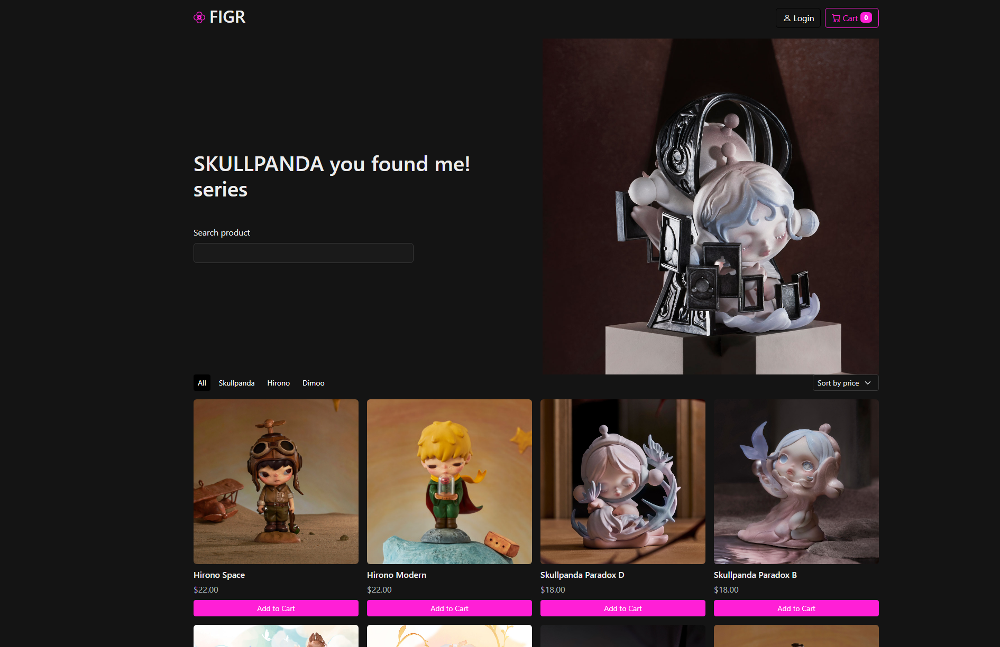

# FIGR - Pop Mart Collection E-commerce App

A Vue.js-based single-page application for selling collectible figures from the Pop Mart collection.

**Live Demo**: [https://figr-mart.vercel.app/](https://figr-mart.vercel.app/)
**Code Documentation**: [HD6 Report](report_docs/hd6-report.pdf) 

## Overview

FIGR is an e-commerce web application built for a university assignment that demonstrates SOLID web development practices. The app allows users to browse, filter, and purchase collectible figures with a complete shopping cart and user authentication system.

## Homepage Preview

## Features
- **Product Catalog**: Browse collectible figures with search and category filtering
- **Shopping Cart**: Add/remove items with quantity management
- **User Authentication**: Registration, login, and profile management
- **Order Processing**: Complete checkout flow with order history
- **Responsive Design**: Mobile-first approach supporting all device sizes
- **Data Persistence**: Session-based storage for cart and user data
- **Accessibility**: WCAG-compliant design with keyboard navigation support

---

*Built with ❤️ for educational purposes*
