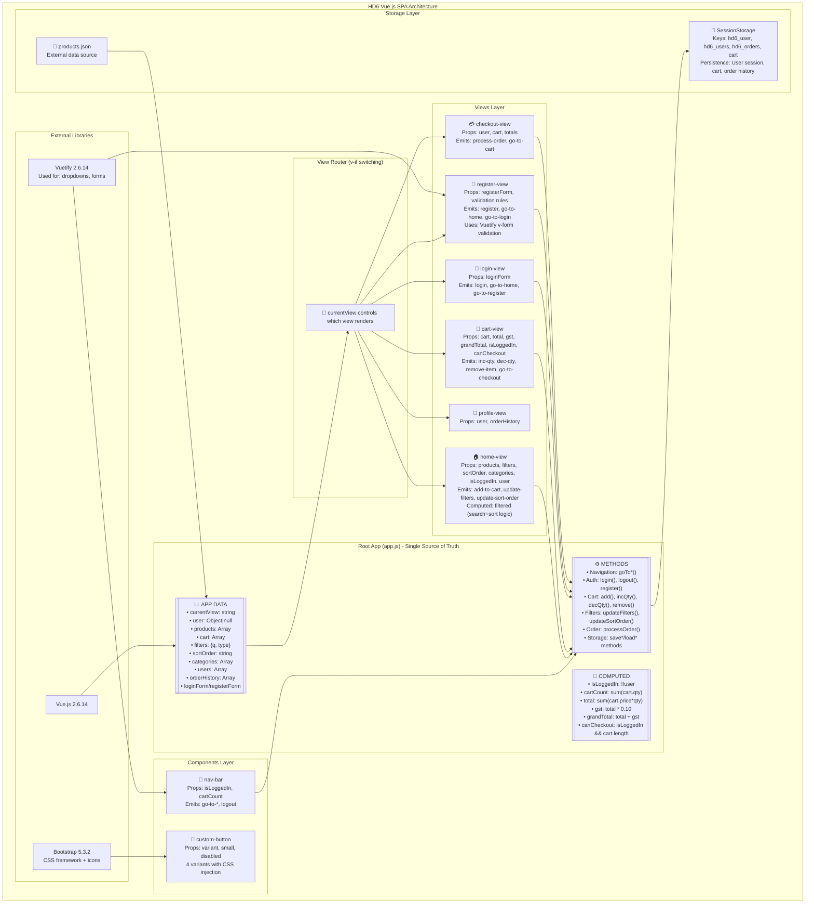
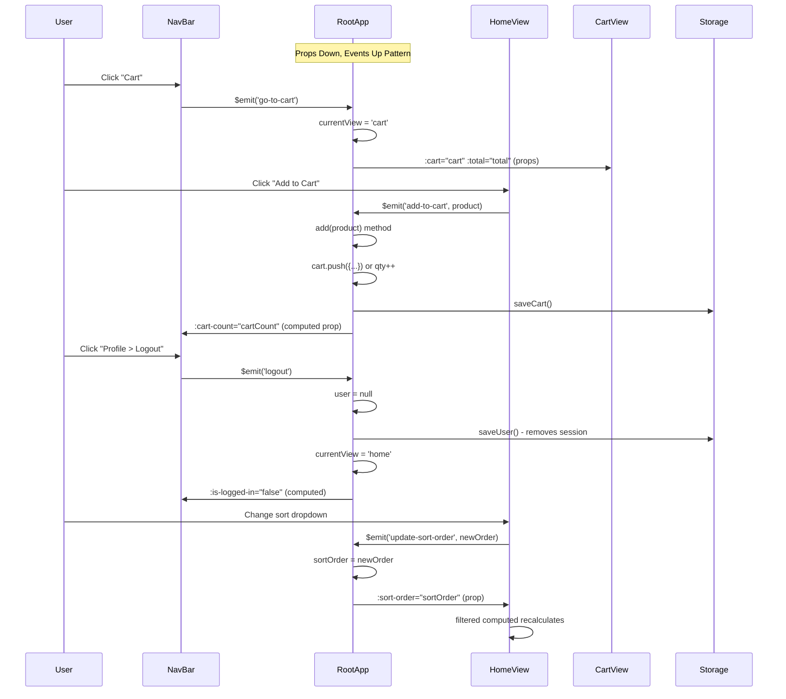
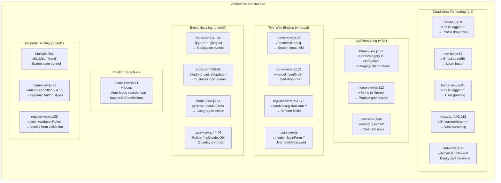
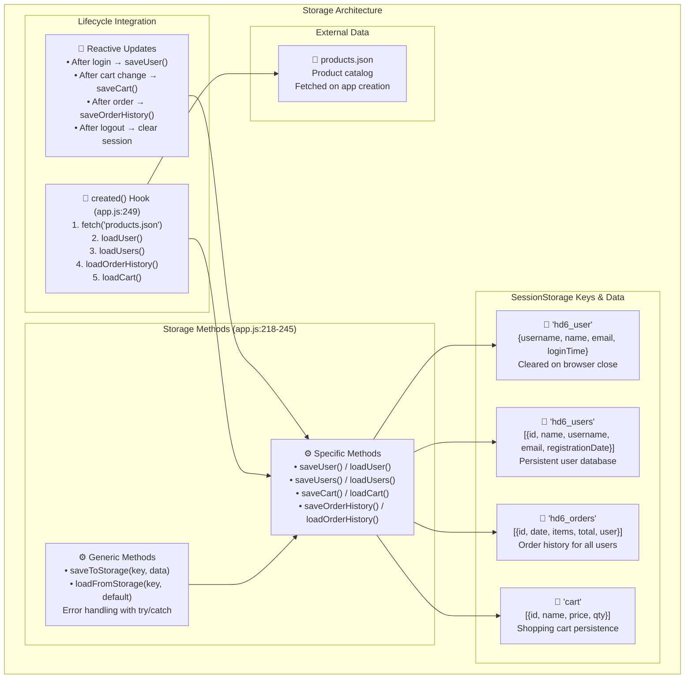
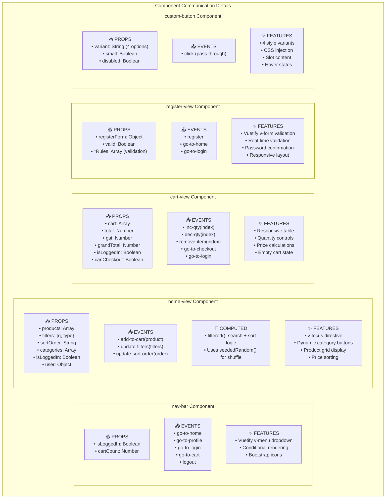
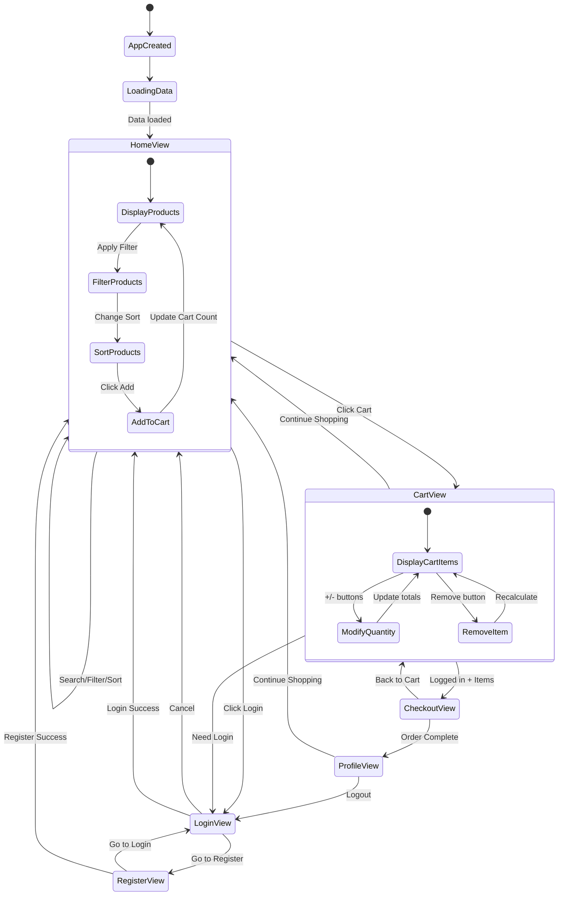

# HD6 Vue.js SPA Architecture - Complete Mermaid Diagrams

## 1. Overall System Architecture

## 2. Event Flow & Communication Architecture

## 3. V-Directive Usage Map

## 4. Storage & Persistence Architecture

## 5. Component Props & Events Detail

## 6. Application Flow & User Journey

## Key Architectural Patterns

- **Single Source of Truth**: All state lives in root app.js
- **Unidirectional Data Flow**: Props down, events up
- **View-Based Routing**: Simple v-if switching instead of Vue Router
- **Persistent State**: SessionStorage for user data, maintains cart across sessions
- **Component Communication**: $emit for child-to-parent, props for parent-to-child
- **Custom Directives**: v-focus for UX enhancement
- **Vuetify Integration**: For complex UI components (dropdowns, forms)
- **Computed Properties**: Reactive calculations (cartCount, totals, isLoggedIn)

This architecture provides clear separation of concerns while maintaining simplicity for a single-page application.